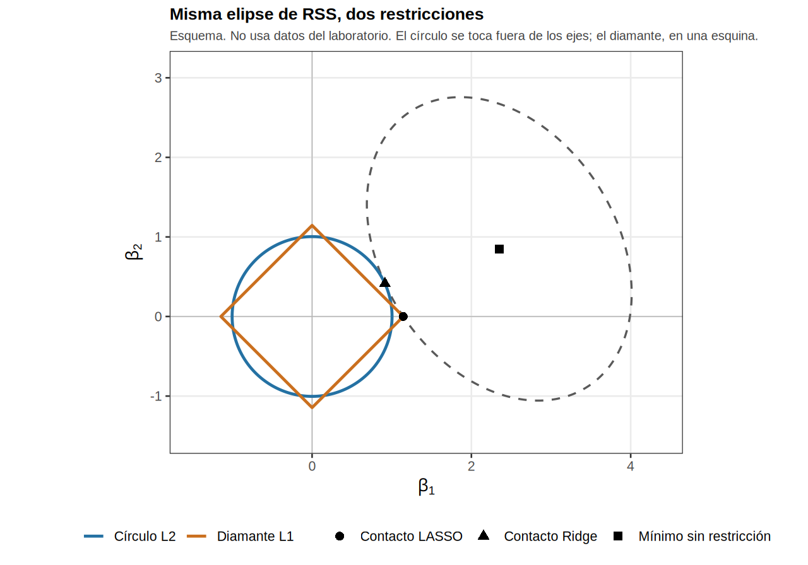
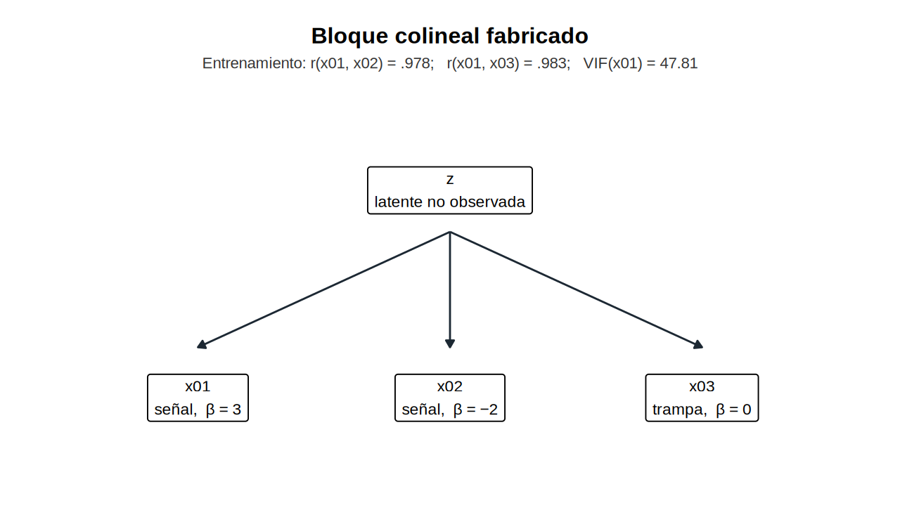
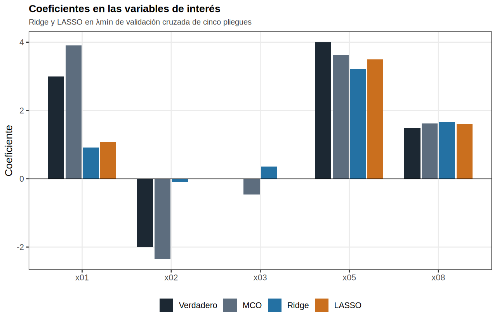
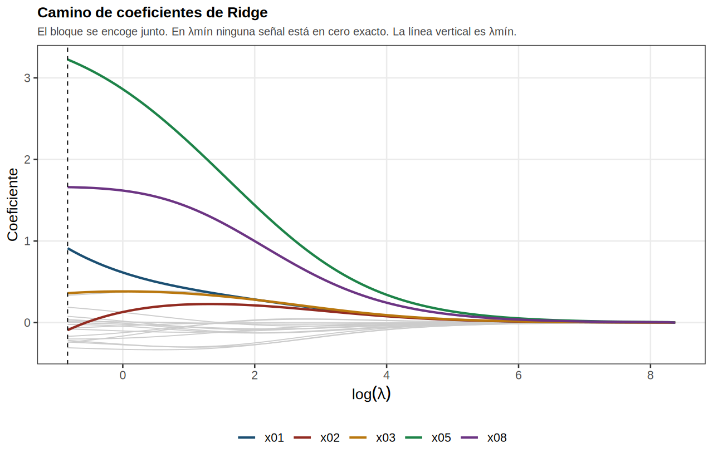
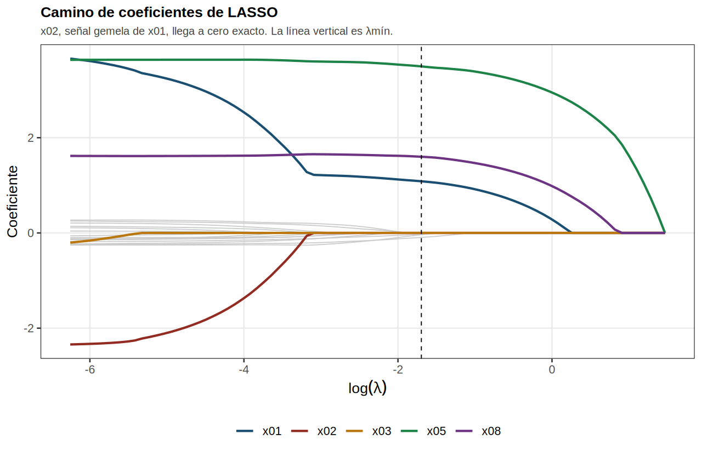
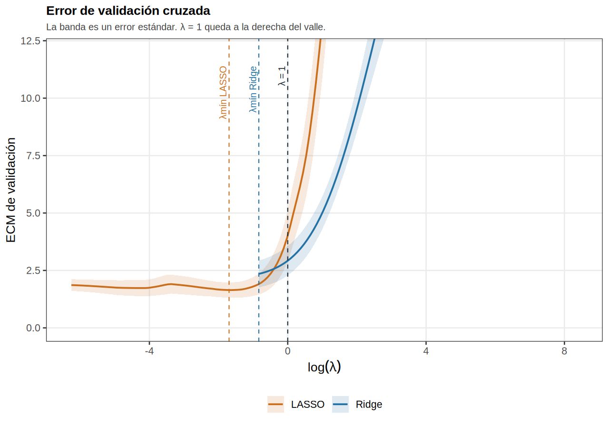
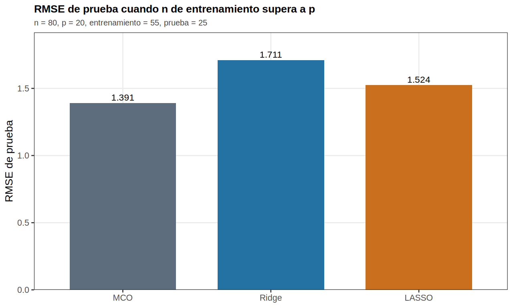
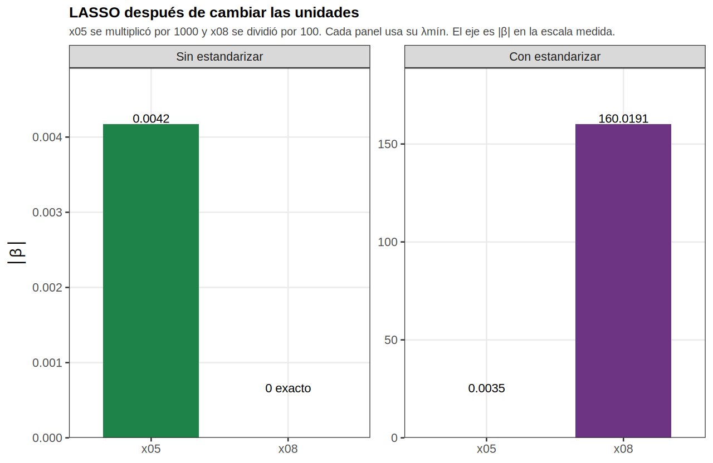
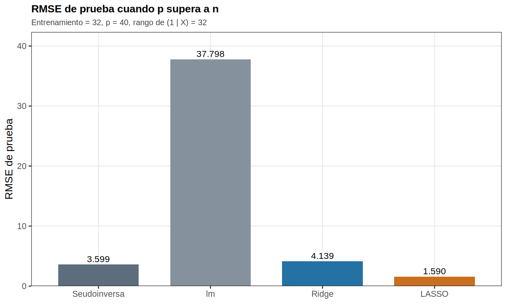

::: {.portada}

# Regularización con Penalización de Ridge y LASSO

## Una bitácora de aprendizaje con un experimento en R

Andrés Felipe Cardozo Gómez

Universidad Autónoma de Occidente

Estadística y Probabilidad 2, Grupo 3, Ingeniería de Datos

Ernesto Peláez García

10 de septiembre de 2026

:::

## Recursos

1. Repositorio del experimento, con el código, las figuras y los datos de esta bitácora: <https://github.com/ByZocar/workshop_1>

Los números de las tablas y de las figuras salen de ese repositorio, en `experimento/run_all.R`. La semilla es 20260908. El ambiente de la corrida es R 4.6.1 y glmnet 5.0.

## Regularización con penalización de Ridge y LASSO

Este trabajo nació de una tarea de Estadística y Probabilidad 2 y, al mismo tiempo, de una confusión mía. Yo creía que ya entendía la regularización porque había oído los nombres Ridge y LASSO. Cuando me tocó explicarlos, me di cuenta de que solo manejaba eslóganes. Lo que sigue es el rastro de ese proceso: primero lo que yo creía, después la teoría que me faltaba, luego los errores que cometí en R y, al final, cómo esos números me obligaron a releer las fórmulas.

## Lo que yo creía al inicio

Llegué al tema con tres ideas incompletas. La primera era que regularizar sirve para no sobreajustar. La frase no es del todo falsa, pero no dice qué se le cobra al modelo, ni por qué el intercepto no se penaliza, ni qué cambia entre un círculo y un diamante.

La segunda era que LASSO quita variables, como un filtro que se aplica antes de estimar. No lo veía como un problema de optimización con una restricción geométrica. Si dos regresores vienen muy correlacionados y los dos son señal, LASSO no los promedia: se queda con uno y apaga el otro. Yo llamaba a eso efecto de agrupamiento. El nombre, bien puesto, es al revés. El *grouping effect* de Zou y Hastie (2005) es la tendencia a tratar parecido a los predictores correlacionados. Lo tiene, en parte, Ridge, y Elastic Net se construye para recuperarlo. Lo que LASSO hizo en el laboratorio fue lo contrario: eligió un representante del grupo.

La tercera era que λ = 1 es un valor razonable y que, si las columnas ya son numéricas, no hace falta estandarizar. Las dos se cayeron en el laboratorio. glmnet arma la escala de λ con los datos. Y LASSO, sin estandarizar, no penaliza importancia: penaliza el tamaño del coeficiente. Una variable medida en unidades grandes y otra medida en centésimas no juegan el mismo juego.

También arrastré una hipótesis peligrosa: si ya conozco modelos, esto es el caso fácil. No lo era. Sabía el nombre. No había interiorizado la geometría ni lo que la colinealidad le hace a mínimos cuadrados ordinarios (MCO). Por eso fabriqué un ejemplo sintético donde yo conocía la verdad: cuatro señales, un señuelo colineal y ruido.

## Marco teórico

### El punto de partida: mínimos cuadrados ordinarios

Tenemos n observaciones y p regresores. El modelo lineal se escribe

yᵢ = β₀ + Σⱼ xᵢⱼ βⱼ + εᵢ, con i = 1, …, n.

MCO elige los coeficientes que hacen lo más chica posible la suma de residuos al cuadrado (RSS, *residual sum of squares*):

RSS(β) = || y − Xβ ||².

Si X′X se puede invertir, la solución es única: β̂ = (X′X)⁻¹ X′y. Tres cosas rompen la tranquilidad de esa fórmula, y las tres aparecieron en el laboratorio.

Primero, p grande frente a n. Si hay tantos o más regresores que filas, X′X deja de ser de rango completo y ya no hay un único β̂ que minimice el RSS. En el segundo escenario, n de entrenamiento fue 32, p fue 40 y el rango de la matriz aumentada (1 | X) fue 32. Hay 41 parámetros. `lm` dejó 9 coeficientes sin definir por singularidades y, al predecir, avisó: `prediction from rank-deficient fit; consider predict(., rankdeficient="NA")`.

Segundo, multicolinealidad. Si dos columnas de X apuntan casi en la misma dirección, X′X está mal condicionada. Los coeficientes se hinchan y la frase «el efecto de xⱼ» se vuelve difícil de sostener. En el entrenamiento del primer escenario, el factor de inflación de varianza (VIF) de x01 contra el resto salió 47.81. La correlación empírica entre x01 y x02 fue .978, y entre x01 y x03 fue .983. El número de condición de X′X, con X centrada, fue 363.9. La matriz se puede invertir. Está mal condicionada.

Tercero, sobreajuste. El RSS de entrenamiento siempre se puede bajar metiendo más columnas. El error que importa es el de fuera de muestra. En el segundo escenario eso se ve crudo: `lm` deja el RSS de entrenamiento en cero, porque interpola las 32 filas, y aun así el RMSE de prueba no es cero.

La regularización no inventa otro modelo. Cambia la función objetivo: al RSS le suma un precio por el tamaño de β. El intercepto β₀ no se penaliza. No es complejidad. Es el nivel de y. En el LASSO de λmín el intercepto estimado fue 0.000, y no entra en el conteo de coeficientes vivos.

### Sesgo, varianza y por qué aceptar un poco de sesgo

La descomposición clásica del error de predicción, en esperanza, es sesgo al cuadrado más varianza más la varianza irreducible del ruido. Cuando el modelo lineal es el verdadero y n alcanza, MCO es insesgado y de varianza mínima entre los lineales insesgados (teorema de Gauss-Markov). Por eso no es un fracaso que, en el escenario n > p, MCO haya ganado en error cuadrático medio de predicción en prueba (RMSE = 1.391, frente a 1.711 de Ridge y 1.524 de LASSO). El proceso generador era lineal y n de entrenamiento = 55 para p = 20 no era ridículo.

Eso me costó aceptarlo. Yo quería que MCO se desmoronara para que el relato quedara limpio. No se desmoronó en predicción. En el bloque colineal los coeficientes sí se movieron, y el método se quedó sin solución única cuando p > n. Regularizar es un intercambio explícito: se acepta sesgo (los β̂ se encogen) para bajar varianza, o para volver a plantear un problema que MCO ya no puede formular.

### Ridge: penalización L2

Ridge (Hoerl y Kennard, 1970) resuelve minimizar el RSS más λ veces la suma de los coeficientes al cuadrado, con λ ≥ 0. Con X centrada y β₀ fuera de la penalización, la solución cerrada es

β̂_Ridge = (X′X + λ I)⁻¹ X′y.

El término λI rellena la diagonal. Aunque X′X sea singular o esté mal condicionada, X′X + λI es invertible si λ > 0. En el escenario p > n, el menor autovalor de X′X centrada fue -2.4e-14. Después de sumar I, el menor autovalor pasó a 1.000. Ridge no es un truco de otro curso. Es una corrección de la matriz que MCO necesita invertir.

Hay dos escalas de λ y no se deben mezclar. En la fórmula cerrada, λ multiplica la identidad. En glmnet, para la familia gaussiana, el criterio es

(1 / (2n)) || y − β₀ − Xβ ||² + λ [ (1 − α)/2 ||β||² + α ||β||₁ ],

con las columnas estandarizadas durante el ajuste y los coeficientes devueltos en la escala original. Los λ de las tablas de validación cruzada son los de glmnet. La tabla de la fórmula cerrada, más abajo, usa el λ del capítulo. El script comprueba que ese λ = 0 reproduce a MCO y que un λ enorme manda las pendientes a cero.

Si λ = 0, Ridge coincide con MCO. Si λ se va a infinito, β̂ se va a cero. Nadie llega exactamente a cero, salvo un caso degenerado, porque el círculo de la restricción L2 no tiene esquinas sobre los ejes. En un bloque correlacionado, Ridge tiende a repartir el efecto entre las columnas.

### LASSO: penalización L1

LASSO (Tibshirani, 1996) cambia el cuadrado por el valor absoluto: se minimiza el RSS más λ veces la suma de |βⱼ|. Ya no hay una fórmula tan limpia como la de Ridge. El algoritmo, descenso por coordenadas en glmnet, importa menos que la geometría. La bola L1 es un diamante. Las elipses de nivel del RSS, al crecer, tocan el diamante en una esquina con alta probabilidad. En esa esquina algunas coordenadas son exactamente cero.

Por eso LASSO selecciona. Y por eso puede ser injusto con un grupo: si x01 y x02 están muy correlacionadas y las dos son señal, el diamante suele quedarse con una. En el laboratorio, x02 verdadera era −2 y LASSO en λmín la mandó a 0, conservando x01 = 1.085. Elastic Net mezcla L1 y L2 precisamente para no tener que coronar a una sola. No era el ajuste principal de esta bitácora. Es la puerta de salida si las dos gemelas importan.

### Geometría: círculo y diamante

La forma restringida, equivalente para algún t que depende de λ, es esta. Ridge: minimizar el RSS sujeto a que la suma de βⱼ al cuadrado no pase de t, un disco. LASSO: minimizar el RSS sujeto a que la suma de |βⱼ| no pase de t, un diamante. La misma idea, no dejar que β se vaya lejos, con distinta esquina. Esa distinción es la que después se tiene que ver en los caminos de coeficientes.



*Figura 1. La elipse punteada es un mismo nivel de RSS. El círculo L2 se toca fuera de los ejes, así que ambos coeficientes siguen vivos. El diamante L1 se toca en una esquina: una coordenada queda en cero. El esquema no usa datos del laboratorio.*

### El control λ y la validación cruzada

λ es el precio. glmnet construye una trayectoria: muchos λ, de muy grandes (modelo nulo) a muy chicos (casi MCO). La validación cruzada estima, para cada λ, el error de predicción. Hay dos reglas habituales. λmín es el valle, el menor error de validación. λ1EE, la regla de un error estándar, es el λ más grande cuyo error de validación no supera el mínimo más un error estándar. En el laboratorio, LASSO con λmín dejó 6 variables vivas. Con λ1EE dejó 3.

Elegir λ = 1 porque es uno no es un método. En estos datos, λ = 1 ya era un martillo: 3 coeficientes distintos de cero (x01, x05 y x08), con x01 en 0.283, x05 en 2.949 y x08 en 0.984. x02 ya estaba muerta. El λmín de LASSO salió 0.183, no 1.

### Estandarizar no es cosmética

Ridge y LASSO no son invariantes a la escala. Si xⱼ se mide en miles y xₖ en centésimas, el coeficiente de xⱼ es pequeño y el de xₖ es grande. La penalización se vuelve una penalización de unidades. glmnet estandariza por defecto: centra, pone cada columna en varianza 1, ajusta y devuelve los coeficientes en la escala original. El intercepto no entra a la penalización.

## Bitácora de laboratorio

El script reproducible está en `experimento/`. Lo que sigue es lo que me planteé, lo que hice mal y lo que entendí después.

### Hipótesis que llevé al teclado

Llevé cuatro hipótesis. Una: MCO iba a explotar en RMSE en cuanto hubiera colinealidad. Dos: λ = 1 era un LASSO suave. Tres: si las columnas eran numéricas, no estandarizar no debería importar. Cuatro: LASSO iba a recuperar las cuatro señales y apagar el resto, como un oráculo. Las cuatro estaban mal, en grados distintos.

### El diseño

No usé un archivo descargado de internet como pieza central. Si no conozco β, no puedo decir que LASSO se equivocó al apagar x02. El proceso generador es este. z, eⱼ, uⱼ y ε son normales estándar independientes.

- x01 = z + 0.16 e₁
- x02 = z + 0.16 e₂
- x03 = z + 0.16 e₃
- x04, …, salvo las señales que faltan, son ruido N(0, 1)
- y = 3 x01 − 2 x02 + 4 x05 + 1.5 x08 + 1.2 ε

Con esa desviación idiosincrática, la correlación poblacional entre dos miembros del bloque es 1 / (1 + 0.16²) = .975. La semilla 20260908 fija las extracciones. El reparto entrenamiento/prueba es un `sample.int` inmediato, y los cinco pliegues salen del mismo flujo, compartidos por Ridge y LASSO.

Tabla 1

*Decisiones del experimento sintético*

| Pieza | Decisión |
| --- | --- |
| Tamaño, n > p | n = 80, p = 20, entrenamiento = 55, prueba = 25 |
| Bloque colineal | x01, x02 y x03 = z + 0.16 e; correlación poblacional ≈ .975 |
| Señales | x01 = 3, x02 = −2, x05 = 4, x08 = 1.5 |
| Trampa | x03 colineal y coeficiente verdadero 0 |
| Ruido de y | desviación 1.2 |
| Validación | cinco pliegues, los mismos para Ridge y LASSO |
| Tamaño, p > n | n = 57, p = 40, entrenamiento = 32, prueba = 25 |

*Nota.* Cada escenario vuelve a llamar `set.seed(20260908)`. No comparten la corriente de aleatorios: son dos diseños.

Si Ridge y LASSO son lo que la teoría dice, deberían encoger el bloque, apagar ruido, dudar con x03 y pelearse por x01 frente a x02. Esa era la pregunta del ejemplo.

### Fallo 1: λ = 1 a ciegas

Pedí LASSO con λ = 1 porque 1 sonaba razonable. Esperaba un modelo casi MCO con un recorte. Obtuve 3 coeficientes distintos de cero: x01, x05 y x08, con valores x01 = 0.283, x05 = 2.949 y x08 = 0.984. x02 ya estaba muerta. El λmín de LASSO salió 0.183. Uno no es una unidad universal. La trayectoria de λ se calibra al problema.

### Fallo 2: yo quería que MCO perdiera, y no perdió

El RMSE de prueba de MCO fue 1.391; el de Ridge, 1.711; el de LASSO, 1.524. MCO ganó. El VIF sí gritaba (47.81). Los coeficientes de MCO, contra la verdad, conservaron el signo: x01 = 3.905 (verdadero 3), x02 = -2.352 (verdadero −2), x05 = 3.633 (verdadero 4), x08 = 1.623 (verdadero 1.5), x03 = -0.457 (verdadero 0). x05 y x08, que no viven en el bloque, quedaron cerca. El bloque colineal se movió, y x03, que debía ser cero, no salió cero. Mi narrativa de «MCO es inútil» no era Gauss-Markov. Cuando el modelo lineal es el verdadero y n alcanza, MCO es difícil de ganar en predicción. El valor del tema, en este escenario, no fue el RMSE: fue qué historia cuenta cada β̂.

### Hallazgo: LASSO apaga una señal por ser gemela

LASSO con λmín dejó 6 vivos: x01, x05, x08, x09, x15 y x20. Entre las señales, x01 = 1.085, x05 = 3.498, x08 = 1.600, y x02 = 0. Los falsos positivos, variables con β verdadero 0 que quedaron vivas, fueron x09 = -0.094, x15 = -0.026 y x20 = -0.036. El mayor de esos |β| fue 0.094, por debajo de x05 y de x08.

La regla de un error estándar dejó 3: x01, x05 y x08. Apagó los falsos positivos. No resucitó a x02. λ1EE fue 0.465, mayor que λmín.

Ridge no apagó a x02: la encogió a -0.092 y le pasó parte a x03 = 0.360, que debía ser cero. x01 quedó en 0.912, lejos del 3 verdadero y del 3.905 de MCO. Ridge reparte. No selecciona. En λmín, Ridge tiene los 20 coeficientes distintos de cero. LASSO tiene 14 ceros exactos de 20.

### Fallo 3: no estandarizar

Multipliqué x05 por 1 000 y dividí x08 por 100, en el conjunto de entrenamiento. Misma información, otras unidades. Volví a elegir λmín con los mismos cinco pliegues.

Sin estandarizar, λmín saltó a 167.001 y quedó un solo coeficiente vivo: x05 = 0.00417. x08 = 0. Con estandarizar, λmín fue 0.183, casi el del problema original, con 6 coeficientes vivos. x08 vuelve con β̂ = 160.019, porque la escala se invierte al devolver el coeficiente a las unidades medidas: es el β̂ original de x08 multiplicado por 100. x05 queda en 0.00350, el β̂ original dividido por 1 000.

La frase que me voy a llevar es esta: LASSO pregunta cuánto cuesta, en valor absoluto del coeficiente, explicar y. Si la columna es enorme, βⱼ es barato y pasa. Si la columna es minúscula, βⱼ es carísimo y el diamante lo manda a la esquina. Estandarizar es parte del método. Sin ese paso, el λ de glmnet también cambia de escala: aquí pasó de 0.183 a 167.001.

### Cuando MCO deja de existir como solución única

En el segundo escenario repetí el mismo proceso generador con más columnas de ruido: n = 57, p = 40, entrenamiento = 32, prueba = 25, otra vez con la semilla 20260908. El rango de (1 | X) fue 32. lm deja el RSS de entrenamiento en 0 y 9 coeficientes sin definir por singularidades. En prueba, ese ajuste marca RMSE 37.798. La seudoinversa, la solución de norma mínima entre las que minimizan el RSS, marca 3.599.

Ridge, con λmín = 43.056, tuvo RMSE 4.139. Un λ grande con muchas columnas puede quedarse corto: aquí no mejoró a la seudoinversa. LASSO, con λmín = 0.441, tuvo RMSE 1.590 y 5 coeficientes vivos (x01, x05, x08, x19 y x38). Otra vez apagó a x02 (0) y conservó x01 = 1.071, x05 = 3.547 y x08 = 0.897. Cuando p > n, la pregunta ya no es si MCO o Ridge. La pregunta es cómo se plantea un problema que MCO no formula con una sola solución.

## Resultados del ejemplo



*Figura 2. x01, x02 y x03 heredan la misma latente. Las dos primeras son señal. x03 es la trampa. El resto de columnas es ruido, salvo x05 y x08. La correlación y el VIF son los del conjunto de entrenamiento.*



*Figura 3. MCO conserva el signo de las señales y mueve el bloque. Ridge encoge el bloque y le pasa parte a x03. LASSO apaga x02, que era señal, y se queda con x01.*

Tabla 2

*Coeficientes verdaderos y estimados en las variables de interés*

| Variable | Verdadero | MCO | Ridge | LASSO |
| --- | --- | --- | --- | --- |
| x01 | 3 | 3.905 | 0.912 | 1.085 |
| x02 | -2 | -2.352 | -0.092 | 0 |
| x03 | 0 | -0.457 | 0.360 | 0 |
| x05 | 4 | 3.633 | 3.225 | 3.498 |
| x08 | 1.5 | 1.623 | 1.660 | 1.600 |

*Nota.* Ridge y LASSO usan λmín de validación cruzada de cinco pliegues. Las otras 15 variables tienen coeficiente verdadero 0. En esas 15, el mayor |β| de MCO fue 0.267, el de Ridge 0.334 y el de LASSO 0.094. LASSO dejó 12 de esas 15 en cero exacto.



*Figura 4. Camino de Ridge contra log(λ). Las líneas de color son x01, x02, x03, x05 y x08. El resto va en gris. La vertical marca λmín = 0.434.*



*Figura 5. Camino de LASSO contra log(λ). x02 llega a cero exacto. La vertical marca λmín = 0.183.*



*Figura 6. ECM de validación cruzada. Las bandas son un error estándar. Las verticales marcan λmín de cada método y λ = 1. El valle no coincide con 1.*

Tabla 3

*Error de predicción en el conjunto de prueba (n > p)*

| Modelo | RMSE | lambda | No ceros |
| --- | --- | --- | --- |
| MCO | 1.391 | — | 20 |
| Ridge | 1.711 | 0.434 | 20 |
| LASSO | 1.524 | 0.183 | 6 |

*Nota.* MCO ganó predicción. El proceso generador era lineal y n todavía alcanzaba. El λ de la tabla es el de glmnet.



*Figura 7. MCO = 1.391, Ridge = 1.711, LASSO = 1.524. Regularizar no mejoró la predicción. Sí cambió la historia de cada coeficiente.*



*Figura 8. x05 ampliada por 1 000 y x08 reducida por 100. Sin estandarizar solo sobrevive x05 (β̂ = 0.00417). Con estandarizar, x08 reaparece (β̂ = 160.019) porque en la escala medida necesita un coeficiente enorme. Cada panel tiene su propio eje.*

Tabla 4

*El mismo LASSO, con y sin estandarizar, después del cambio de unidades*

| Ajuste | lambda min | x05 | x08 | No ceros |
| --- | --- | --- | --- | --- |
| Sin estandarizar | 167.001 | 0.00417 | 0 | 1 |
| Con estandarizar | 0.183 | 0.00350 | 160.019 | 6 |



*Figura 9. Entrenamiento = 32, p = 40, rango = 32. Seudoinversa = 3.599, lm = 37.798, Ridge = 4.139, LASSO = 1.590.*

Tabla 5

*Error de predicción cuando p > n*

| Modelo | RMSE | lambda | No ceros |
| --- | --- | --- | --- |
| Seudoinversa | 3.599 | — | — |
| lm | 37.798 | — | — |
| Ridge | 4.139 | 43.056 | 40 |
| LASSO | 1.590 | 0.441 | 5 |

## Análisis: la teoría en estos números

RSS y penalización. MCO minimiza solo el RSS de entrenamiento: 39.34. Ridge lo deja en 58.84 y LASSO en 68.17. A cambio, la norma L2 de las pendientes pasa de 6.11 a 3.82, y la norma L1 de 14.54 a 6.34. En n > p ese canje no mejoró el RMSE de prueba. En p > n el canje de LASSO sí: 1.590 contra 3.599 de la seudoinversa.

Sesgo y varianza. Ridge sesgó x01 desde el verdadero 3, y desde el 3.905 de MCO, hacia 0.912. Ese sesgo es el precio de no invertirle a X′X toda la confianza. En n > p el precio fue innecesario para predecir. En colinealidad, el precio compra otra lectura: nadie se lleva toda la culpa del bloque.

Geometría L2 frente a L1. Ceros exactos en Ridge, en λmín: ninguno. Ceros exactos en LASSO con λmín: 14 de 20. Eso es el diamante tocando el eje.

Un representante, no el soporte entero. x01 y x02 eran las dos señal y r = .978. LASSO conservó una. La frase que sí puedo defender es: LASSO recupera un representante del grupo. El diseño principal usa desviación idiosincrática 0.16 (correlación .978, x02 de LASSO en 0). Con desviación idiosincrática 0.20 la correlación fue .966, LASSO ya no apagó x02: el coeficiente fue -1.671, y en test LASSO quedó por debajo de MCO (1.374 frente a 1.391). Con desviación idiosincrática 0.40 la correlación fue .883, LASSO ya no apagó x02: el coeficiente fue -1.652, y MCO siguió por debajo en test (1.387 frente a 1.401 de LASSO). La misma semilla y las mismas extracciones: solo cambia cuánto ruido propio tiene el bloque. El diamante no mata a la gemela por decreto.

Tabla 6

*La misma semilla, tres desviaciones idiosincráticas*

| sd | cor | VIF | RMSE MCO | RMSE LASSO | LASSO x02 |
| --- | --- | --- | --- | --- | --- |
| 0.16 | 0.978 | 47.81 | 1.391 | 1.524 | 0 |
| 0.20 | 0.966 | 31.52 | 1.391 | 1.374 | -1.671 |
| 0.40 | 0.883 | 9.35 | 1.387 | 1.401 | -1.652 |

λ y validación cruzada. λ = 1 no coincidió con el valle. λ1EE produjo un modelo más corto (3 vivos) que λmín (6 vivos). Elegir λ es parte del estimador.

Estandarización. El experimento de las escalas convierte la penalización en una penalización de unidades. Con estandarizar, el ajuste es el mismo LASSO de la Tabla 2 escrito en las unidades nuevas. Sin estandarizar, la trayectoria de λ se recalibra y x08 desaparece.

Cuando MCO no existe como solución única. Rango 32 frente a 41 parámetros. Ahí regularizar no es mejorar a MCO: es definir el problema. La fórmula cerrada lo dice en una cuenta. El menor autovalor, -2.4e-14, pasa a 1.000 al sumar I.

Tabla 7

*Fórmula cerrada de Ridge en el entrenamiento de n > p, con X centrada*

| lambda | x01 | x02 | x03 | x05 | x08 |
| --- | --- | --- | --- | --- | --- |
| 0 | 3.905 | -2.352 | -0.457 | 3.633 | 1.623 |
| 1 | 2.046 | -0.975 | 0.106 | 3.532 | 1.649 |
| 10 | 0.678 | 0.107 | 0.345 | 2.916 | 1.635 |
| 100 | 0.275 | 0.193 | 0.238 | 1.292 | 0.918 |

*Nota.* Este λ no es el de glmnet. λ = 0 reproduce a MCO. Al crecer λ, el bloque se encoge y x05 y x08, que casi no comparten dirección con nadie, resisten más.

## Conclusiones

Ridge y LASSO le ponen precio a la norma de β, con L2 o con L1, y ese precio cambia existencia, varianza e interpretación. Ridge encoge y comparte el bloque colineal. No selecciona. LASSO selecciona y, por el diamante, puede apagar una señal que tenía una gemela. λ se elige con validación cruzada: λmín y λ1EE contaron historias distintas (6 frente a 3 vivos). Estandarizar es parte del método. El fallo de las escalas fue el experimento que más me corrigió. Cuando n alcanza y el proceso es lineal, MCO puede ganar RMSE y aun así contar peor el bloque colineal. Cuando p supera a n, MCO ya no tiene una solución única: `lm` interpola el entrenamiento y deja coeficientes sin definir.

Lo que me queda, más que una lista de fórmulas, es una forma de leer un ajuste: preguntar qué se minimizó, qué se penalizó, en qué unidades, en qué escala de λ, y si la solución de MCO existía.

## Cómo reproducir

Desde la raíz del repositorio:

```bash
Rscript experimento/run_all.R
```

Hacen falta R 4.6.1, glmnet 5.0 y ggplot2 4.0.3. El script vuelve a escribir las figuras, las tablas, `informe/bitacora.md`, `informe/bitacora.html` y `informe/Informe_Ridge_LASSO.pdf`. `experimento/R/verificar.R` corta la corrida si alguna afirmación del relato deja de cumplirse.

## Referencias

Cardozo Gómez, A. F. (2026). *Regularización con penalización de Ridge y LASSO: código, figuras y bitácora* [Repositorio]. https://github.com/ByZocar/workshop_1

Friedman, J., Hastie, T. y Tibshirani, R. (2010). Regularization paths for generalized linear models via coordinate descent. *Journal of Statistical Software, 33*(1), 1-22. https://doi.org/10.18637/jss.v033.i01

Hastie, T., Tibshirani, R. y Friedman, J. (2009). *The elements of statistical learning: Data mining, inference, and prediction* (2.ª ed.). Springer. https://doi.org/10.1007/978-0-387-84858-7

Hoerl, A. E. y Kennard, R. W. (1970). Ridge regression: Biased estimation for nonorthogonal problems. *Technometrics, 12*(1), 55-67. https://doi.org/10.1080/00401706.1970.10488634

James, G., Witten, D., Hastie, T. y Tibshirani, R. (2021). *An introduction to statistical learning: With applications in R* (2.ª ed.). Springer. https://doi.org/10.1007/978-1-0716-1418-1

Tibshirani, R. (1996). Regression shrinkage and selection via the lasso. *Journal of the Royal Statistical Society: Series B (Methodological), 58*(1), 267-288. https://doi.org/10.1111/j.2517-6161.1996.tb02080.x

Zou, H. y Hastie, T. (2005). Regularization and variable selection via the elastic net. *Journal of the Royal Statistical Society: Series B (Statistical Methodology), 67*(2), 301-320. https://doi.org/10.1111/j.1467-9868.2005.00503.x
